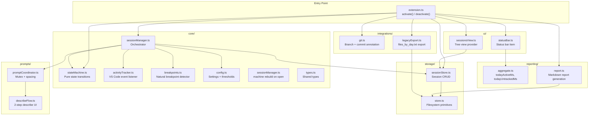
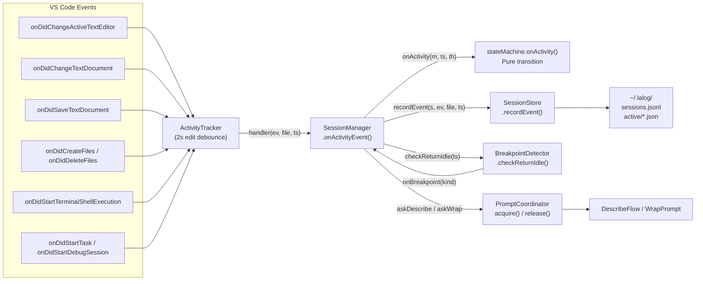
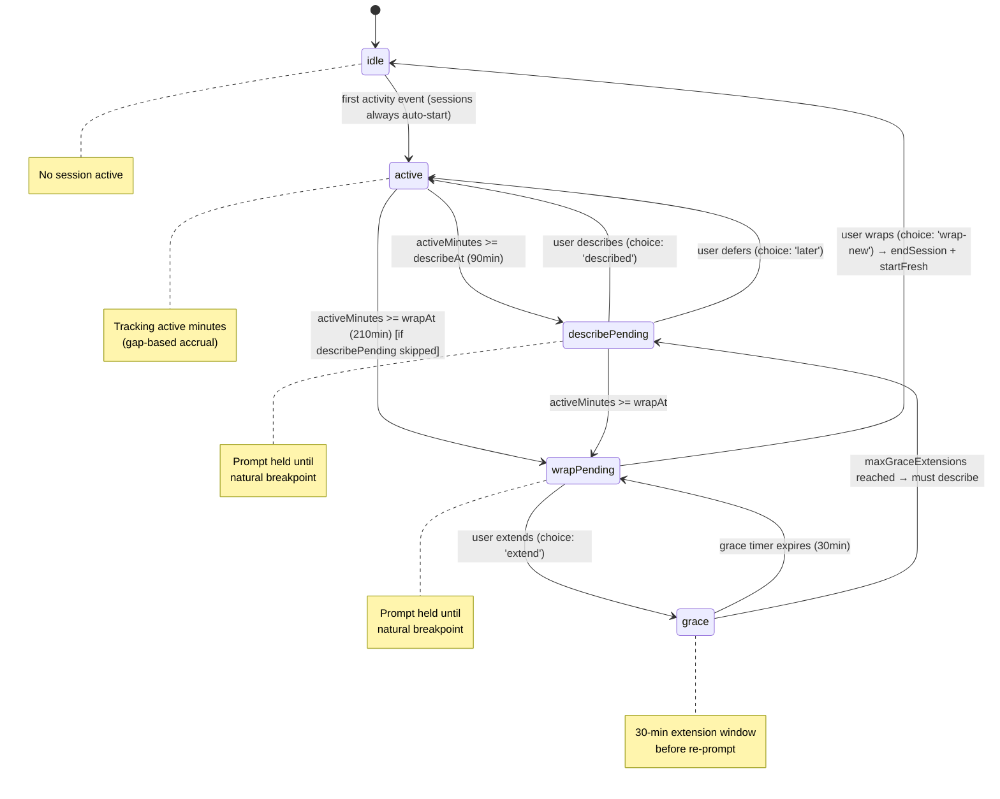
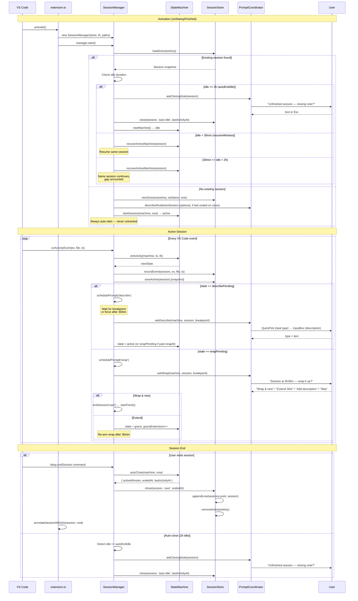
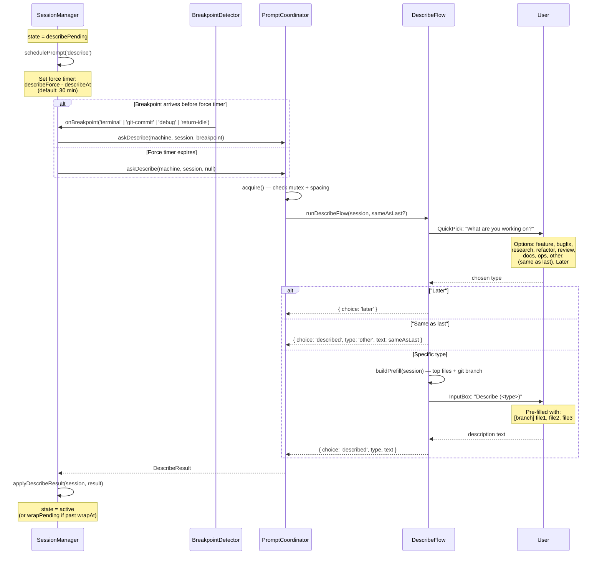
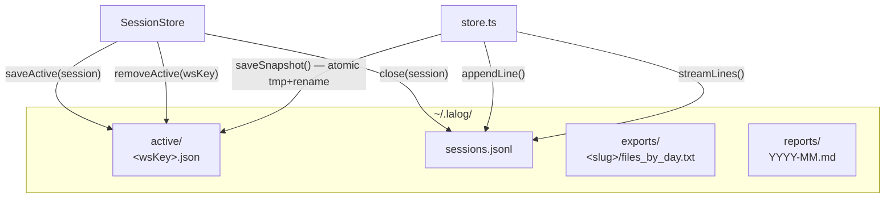
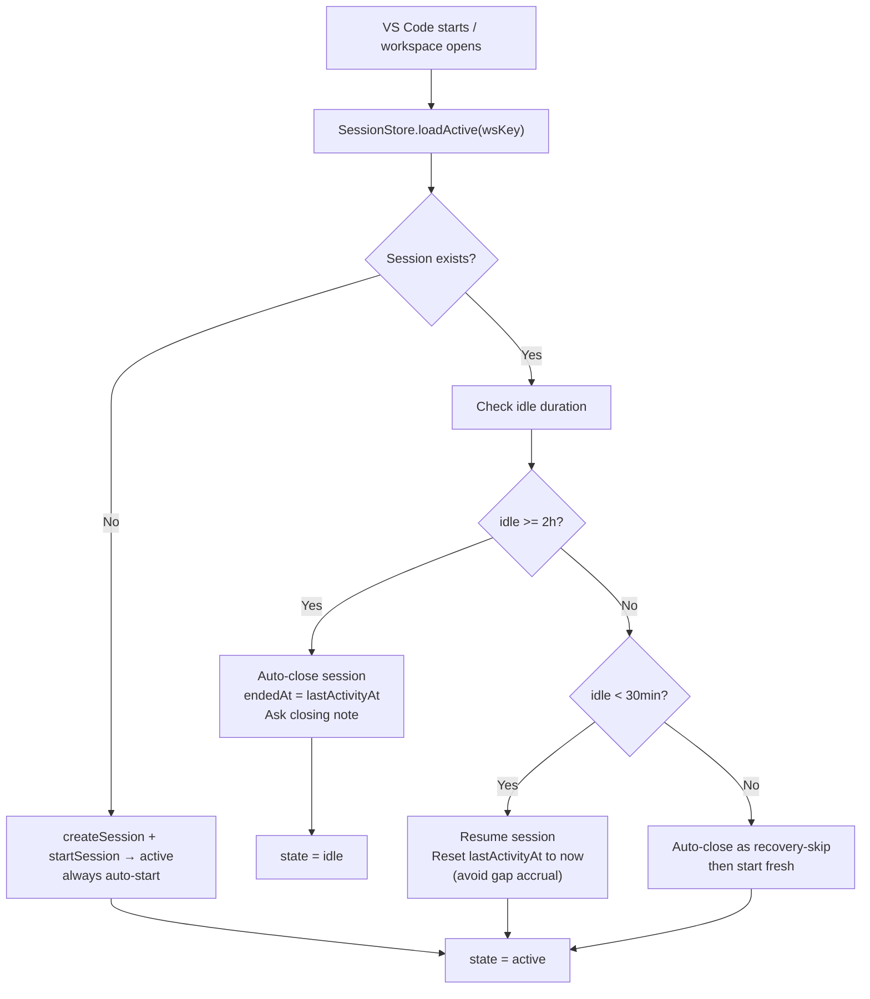

# Architecture

[Home](README.md) > **architecture**

> Module overview, data flow, and design philosophy of the LaLog extension.

---

## Table of Contents

- [Design Philosophy](#design-philosophy)
- [Module Map](#module-map)
- [Data Flow](#data-flow)
- [State Machine](#state-machine)
- [Session Lifecycle](#session-lifecycle)
- [Prompt Flow](#prompt-flow)
- [Storage Model](#storage-model)
- [Recovery Model](#recovery-model)

---

## Design Philosophy

LaLog is built on five principles:

1. **Passive capture, active description** — The extension captures events (edits, saves, terminal, file ops, debug, tasks) automatically. The human only provides descriptions at natural breakpoints.
2. **Sessions are engagement threads** — Not day-bound. An overnight coding session from 22:00 to 02:00 is one session. The only boundary is ~2h idle.
3. **Never trust interval timers; confirm idle** — Active time is computed from event gaps, not `setInterval`. If you step away for more than 15 minutes, that gap is not counted — unless you confirm "Are you still there?", in which case the idle stretch counts as active but *outside* VS Code (tagless spans classified at report time).
4. **Breakpoint-aligned prompting** — Prompts are held until a natural pause (terminal command ends, debug session terminates, return from idle). No interrupting flow.
5. **Local-only, crash-safe** — JSONL append-only storage. Atomic snapshots for active sessions. Zero telemetry.

---

## Module Map



### Module Responsibilities

| Module | Files | Responsibility |
|--------|-------|----------------|
| **core/** | `stateMachine.ts`, `sessionManager.ts`, `activityTracker.ts`, `breakpoints.ts`, `config.ts`, `spans.ts`, `types.ts` | Pure state machine, session orchestration (idle/progress/auto-end checks), VS Code event capture, breakpoint detection, configuration, active-span arithmetic |
| **prompts/** | `promptCoordinator.ts`, `describeFlow.ts` | Prompt mutex (one at a time, min spacing), 2-step describe UI (type picker → input box), on-start/progress/close note prompts |
| **storage/** | `sessionStore.ts`, `store.ts` | Session CRUD, JSONL append, atomic snapshots, filesystem primitives |
| **reporting/** | `aggregate.ts`, `report.ts`, `spans.ts` | Today's active/untracked time, session-centric markdown reports, in/out-of-VS-Code split |
| **integrations/** | `git.ts`, `legacyExport.ts` | Git branch/commit annotation, legacy `files_by_day.txt` export |
| **ui/** | `statusBar.ts`, `sessionsView.ts` | Status bar (live duration + description), tree view (sessions grouped by day with per-session detail rows) |

---

## Data Flow



### Event Processing Pipeline

1. **VS Code fires an event** (editor change, document edit, save, file op, terminal, task, debug)
2. **ActivityTracker** receives it, applies a 2-second debounce on edits (to coalesce rapid keystrokes), and calls the handler
3. **SessionManager.onActivityEvent()** is the orchestrator:
   - Calls `stateMachine.onActivity(machine, ts, thresholds)` — pure state transition
   - Calls `sessionStore.recordEvent(session, event, filePath, ts)` — increments counters, updates topFiles
   - Calls `breakpoints.checkReturnIdle(ts)` — detects return-from-idle breakpoint
   - Schedules persistence (`saveActive` snapshot)
   - Evaluates prompt state: if `describePending` or `wrapPending`, schedules prompt delivery
4. **BreakpointDetector** signals natural breakpoints (terminal end, git commit, debug end, return-idle)
5. **PromptCoordinator** enforces mutex (one prompt visible at a time) and minimum spacing
6. **DescribeFlow / WrapPrompt** presents the UI (QuickPick → InputBox)
7. **SessionStore** persists to JSONL (closed sessions) or atomic snapshot (active sessions)

---

## State Machine

The state machine is a pure function: `(state, event, thresholds) → newState`. It lives in `src/core/stateMachine.ts` and has no side effects.



### State Transitions

| From | To | Trigger | Condition |
|------|----|---------|-----------|
| `idle` | `active` | `onActivity()` | First event after activation (sessions auto-start) |
| `active` | `describePending` | `onActivity()` | `activeMinutes >= describeAt` (default 90 min) |
| `active` | `wrapPending` | `onActivity()` | `activeMinutes >= wrapAt` (default 210 min) |
| `describePending` | `active` | describe reply | User provides description or defers |
| `describePending` | `wrapPending` | `onActivity()` | `activeMinutes >= wrapAt` while waiting for describe |
| `wrapPending` | `grace` | wrap reply | User chooses "Extend 30 min" |
| `wrapPending` | `idle` | wrap reply | User chooses "Wrap & start new" → `endSession()` |
| `grace` | `wrapPending` | timer | Grace period (30 min) expires |
| `grace` | `describePending` | `onActivity()` | `maxGraceExtensions` reached → must describe |

### Active Time Accrual

Active minutes are computed from **event gaps**, not wall-clock time:

```typescript
// In stateMachine.onActivity():
if (m.lastActivityAt !== null) {
  const gap = now - m.lastActivityAt;
  if (gap < th.idleGap) {        // idleGap default: 15 min
    m.activeMinutes += gap;       // only count gaps < 15 min
  }
}
m.lastActivityAt = now;
```

This means:
- If you type continuously with <15 min between events, every millisecond counts
- If you step away for 20 minutes, that gap is **not** counted — unless you confirm "still working", which counts it as active but outside VS Code
- If you step away for 3 hours, the session stays open but accrues 0 active minutes during that time
- After 2h idle (`autoEndIdle`), the session auto-closes with `endedAt = lastActivityAt`

---

## Session Lifecycle



---

## Prompt Flow



### Prompt Coordinator Mutex

The `PromptCoordinator` enforces:
1. **One prompt visible at a time** — `acquire()` returns false if another prompt is showing
2. **Minimum spacing** — at least 2 minutes between prompts (scaled by `debugTimeScale`)
3. **Non-blocking** — if `acquire()` fails, the prompt is silently skipped (state remains pending)

---

## Storage Model



### Storage Primitives

| Function | File | Atomicity | Purpose |
|----------|------|-----------|---------|
| `appendLine(file, data)` | `store.ts` | POSIX near-atomic (open-append-write-close) | Append closed session to JSONL |
| `saveSnapshot(file, data)` | `store.ts` | Atomic (write tmp → rename) | Persist active session snapshot |
| `readSnapshot(file)` | `store.ts` | Read-only | Load active session on recovery |
| `streamLines(file, onLine)` | `store.ts` | Streaming | Read all closed sessions (skips malformed lines) |

### Why JSONL?

- **Crash-safe** — append-only, no partial writes corrupt the file
- **Human-readable** — `cat sessions.jsonl | jq .` works
- **Grep-friendly** — `grep '"workspaceKey":"abc"' sessions.jsonl`
- **Append-only** — no read-modify-write cycles for normal operation
- **Exception: `updateSession()`** — rewrites the full file to patch a session's fields (used by the "Edit session" command)

---

## Recovery Model



### Recovery Guarantees

1. **No zombie sessions** — only a real activity event resets the idle clock, never a periodic timer or window reopen
2. **No gap accrual on reopen** — when recovering, `lastActivityAt` is set to `now` so the first event doesn't accrue a giant gap
3. **Snapshot persistence** — active sessions are saved every 60 seconds (heartbeat) and on every state change
4. **Atomic snapshots** — write to `.tmp` then rename, so a crash mid-write doesn't corrupt the snapshot

---

## Related Pages

- [Features](features.md) — detailed feature documentation
- [Decisions](decisions.md) — Architecture Decision Records
- [Data Format](data-format.md) — JSONL schema and snapshot format
- [Development](development.md) — build, test, and run